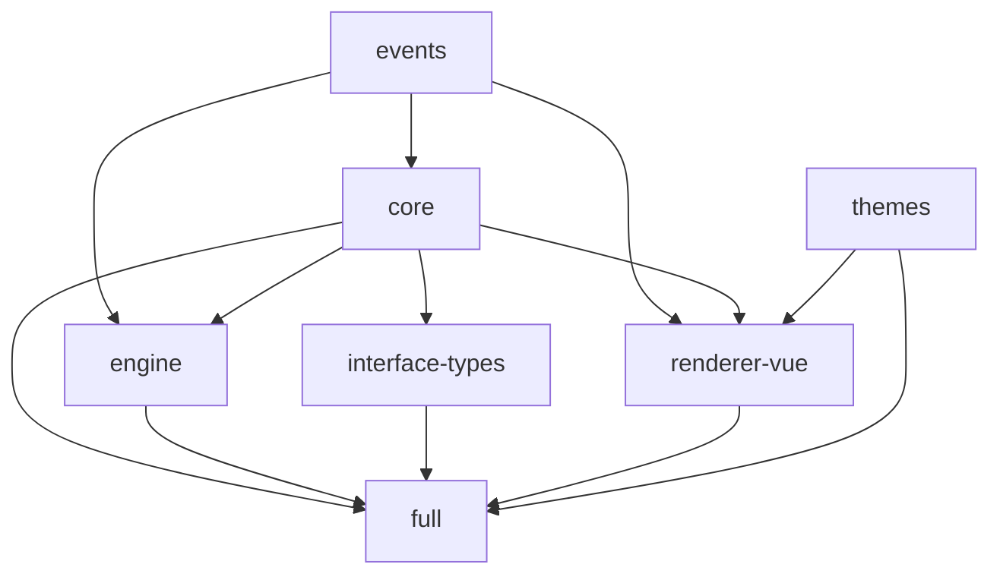

# BaklavaJS 开发指南

本文档提供了 BaklavaJS 项目的完整开发流程指导，帮助开发者快速上手并参与项目开发。

## 项目概述

BaklavaJS 是一个基于 Web 的图形/节点编辑器，使用 VueJS 构建。项目采用 TypeScript 开发，确保类型安全，并提供强大的插件系统以支持扩展性。

### 核心特性
- 🎯 **类型安全**: 完全使用 TypeScript 编写
- 🔌 **插件系统**: 强大的扩展性支持
- 🎨 **Vue 渲染**: 基于 VueJS 的现代 UI
- ⚡ **高性能**: 优化的图形渲染和计算引擎
- 📦 **模块化**: 按需加载的包结构

## 项目架构

### Monorepo 结构

项目使用 Lerna + Nx 管理 monorepo，包含以下核心包：

```
packages/
├── core/                    # 核心逻辑包
├── engine/                  # 执行引擎包
├── events/                  # 事件系统包
├── interface-types/         # 接口类型包
├── renderer-vue/            # Vue 渲染器包
├── themes/                  # 主题包
└── full/                    # 完整功能包
```

### 包依赖关系



### 核心包说明

| 包名 | 描述 | 主要功能 |
|------|------|----------|
| `@baklavajs/core` | 核心逻辑 | 编辑器、图形、节点、连接管理 |
| `@baklavajs/engine` | 执行引擎 | 图形计算、依赖解析、执行调度 |
| `@baklavajs/events` | 事件系统 | 事件发布订阅机制 |
| `@baklavajs/interface-types` | 接口类型 | 类型系统、类型转换 |
| `@baklavajs/renderer-vue` | Vue 渲染器 | UI 组件、视觉编辑器 |
| `@baklavajs/themes` | 主题系统 | 预构建主题样式 |
| `baklavajs` | 完整包 | 包含所有功能的集成包 |

## 开发环境设置

### 系统要求

- **Node.js**: >= 16.0.0
- **Yarn**: >= 3.5.1 (项目使用 Yarn 3)
- **Git**: 最新版本

### 初始化项目

```bash
# 1. 克隆项目
git clone https://github.com/newcat/baklavajs.git
cd baklavajs

# 2. 安装依赖
yarn install

# 3. 构建所有包
yarn build

# 4. 运行测试
yarn test
```

### 开发工具配置

#### VS Code 推荐设置

创建 `.vscode/settings.json`：

```json
{
  "typescript.preferences.includePackageJsonAutoImports": "on",
  "typescript.suggest.autoImports": true,
  "editor.codeActionsOnSave": {
    "source.fixAll.eslint": true
  },
  "editor.formatOnSave": true,
  "editor.defaultFormatter": "esbenp.prettier-vscode"
}
```

#### 推荐扩展

- ESLint
- Prettier
- Vetur (Vue 支持)
- TypeScript Importer

## 开发工作流程

### 1. 代码规范

#### TypeScript 配置

项目使用严格的 TypeScript 配置：

```json
{
  "compilerOptions": {
    "target": "ES2019",
    "module": "CommonJS",
    "strict": true,
    "moduleResolution": "node",
    "esModuleInterop": true,
    "allowSyntheticDefaultImports": true,
    "declaration": true,
    "skipLibCheck": true
  }
}
```

#### ESLint 规则

项目使用以下 ESLint 配置：
- TypeScript 推荐规则
- Vue 推荐规则
- Prettier 集成
- 自定义规则优化

#### 代码格式化

使用 Prettier 进行代码格式化：

```bash
# 检查代码格式
yarn lint

# 自动修复格式问题
yarn lint --fix
```

### 2. 构建系统

#### 构建脚本

每个包都有标准的构建脚本：

```json
{
  "scripts": {
    "build:esm": "tsc --outDir dist/esm --module esnext",
    "build:cjs": "tsc --outDir dist/cjs",
    "build:declaration": "tsc --emitDeclarationOnly --outDir dist",
    "build": "rimraf dist && yarn run build:esm && yarn run build:cjs && yarn run build:declaration"
  }
}
```

#### 构建产物

每个包构建后生成：
- `dist/esm/` - ES 模块
- `dist/cjs/` - CommonJS 模块
- `dist/*.d.ts` - TypeScript 声明文件

### 3. 测试策略

#### 测试框架

- **Jest**: 单元测试框架
- **TypeScript**: 测试代码类型检查
- **Coverage**: 代码覆盖率报告

#### 运行测试

```bash
# 运行所有测试
yarn test

# 运行特定包的测试
cd packages/core
yarn test

# 运行测试并生成覆盖率报告
yarn test --coverage
```

#### 测试文件结构

```
packages/core/
├── src/
│   ├── editor.ts
│   └── graph.ts
└── test/
    ├── editor.spec.ts
    └── graph.spec.ts
```

### 4. API 文档生成

项目使用 TypeDoc 自动生成 API 文档，提供完整的类型定义和使用说明。

#### 生成 API 文档

```bash
# 生成完整的 API 文档
yarn generate-api-docs
```

#### 文档配置

API 文档配置位于 `typedoc.json`：

```json
{
  "entryPoints": ["packages/*/src/index.ts"],
  "out": "docs/public/api",
  "plugin": ["typedoc-plugin-markdown"],
  "theme": "default",
  "excludePrivate": true,
  "excludeProtected": true
}
```

#### 文档结构

生成的 API 文档包含：

- **Classes** - 所有公共类的详细说明
- **Interfaces** - TypeScript 接口定义
- **Functions** - 公共函数和方法
- **Types** - 类型别名和联合类型
- **Enums** - 枚举定义
- **Modules** - 各个包的模块结构

#### 文档访问

生成的文档位于 `docs/public/api/` 目录：

```
docs/public/api/
├── classes/           # 类文档
├── interfaces/        # 接口文档
├── functions/         # 函数文档
├── types/            # 类型文档
├── enums/            # 枚举文档
├── modules/          # 模块文档
└── index.html        # 文档首页
```

#### 文档注释规范

为确保生成高质量的 API 文档，请遵循以下注释规范：

```typescript
/**
 * 类或函数的简短描述
 * 
 * 详细描述可以包含多行，解释功能、用途和注意事项
 * 
 * @param paramName - 参数描述
 * @returns 返回值描述
 * @example
 * ```typescript
 * // 使用示例
 * const result = myFunction(param);
 * ```
 * 
 * @since 版本号
 * @see 相关链接或引用
 */
export function myFunction(paramName: string): boolean {
  // 实现
}
```

#### 常见问题

1. **文档生成警告**: 如果看到 `@param` 标签未使用的警告，检查参数名称是否匹配
2. **缺失文档**: 确保所有公共 API 都有适当的 JSDoc 注释
3. **类型引用**: 使用 `@link` 标签创建类型之间的交叉引用

### 5. 开发服务器

#### Vue 渲染器开发

```bash
# 启动开发服务器
yarn playground

# 或者直接在 renderer-vue 包中
cd packages/renderer-vue
yarn dev
```

这将启动一个包含示例的开发服务器，可以实时预览更改。

## 包开发指南

### 1. Core 包开发

核心包包含以下主要模块：

- `editor.ts` - 编辑器主类
- `graph.ts` - 图形管理
- `node.ts` - 节点基类
- `connection.ts` - 连接管理
- `nodeInterface.ts` - 节点接口

#### 添加新功能

1. 在 `src/` 目录创建新模块
2. 在 `index.ts` 中导出
3. 添加对应的测试文件
4. 更新类型声明

### 2. Engine 包开发

执行引擎包含：

- `baseEngine.ts` - 引擎基类
- `dependencyEngine.ts` - 依赖引擎
- `forwardEngine.ts` - 前向引擎

#### 性能优化

- 使用拓扑排序优化执行顺序
- 实现节点缓存机制
- 支持异步节点执行

### 3. Renderer-Vue 包开发

 Vue 渲染器使用 Vite 构建：

```bash
# 开发模式
yarn dev

# 构建生产版本
yarn build

# 类型检查
vue-tsc --noEmit
```

#### 组件结构

```
src/
├── components/          # Vue 组件
├── composables/         # Vue 组合式函数
├── styles/             # 样式文件
└── index.ts            # 入口文件
```

## 发布流程

### 1. 版本管理

项目使用 Lerna 管理版本：

```bash
# 更新版本
lerna version

# 发布到 npm
lerna publish
```

### 2. 发布检查清单

- [ ] 所有测试通过
- [ ] 代码格式检查通过
- [ ] 构建成功
- [ ] 更新 CHANGELOG.md
- [ ] 更新文档
- [ ] 版本号符合语义化版本规范

### 3. CI/CD 流程

GitHub Actions 自动化流程：

1. **构建检查**: 每次 PR 触发
2. **测试运行**: 多环境测试
3. **自动发布**: 标签推送时触发
4. **文档部署**: 主分支更新时触发

## 调试指南

### 1. 开发调试

#### 浏览器调试

```javascript
// 在代码中添加断点
debugger;

// 使用 console 调试
console.log('Debug info:', data);
console.table(nodes);
```

#### VS Code 调试

创建 `.vscode/launch.json`：

```json
{
  "version": "0.2.0",
  "configurations": [
    {
      "name": "Debug Jest Tests",
      "type": "node",
      "request": "launch",
      "program": "${workspaceFolder}/node_modules/.bin/jest",
      "args": ["--runInBand"],
      "console": "integratedTerminal",
      "internalConsoleOptions": "neverOpen"
    }
  ]
}
```

### 2. 性能调试

#### 性能分析

```javascript
// 性能标记
performance.mark('start-calculation');
// ... 执行代码
performance.mark('end-calculation');
performance.measure('calculation', 'start-calculation', 'end-calculation');
```

#### 内存泄漏检测

使用浏览器开发工具的 Memory 面板检测内存泄漏。

## 贡献指南

### 1. 提交规范

使用 Conventional Commits 规范：

```
type(scope): description

[optional body]

[optional footer]
```

类型说明：
- `feat`: 新功能
- `fix`: 修复 bug
- `docs`: 文档更新
- `style`: 代码格式调整
- `refactor`: 代码重构
- `test`: 测试相关
- `chore`: 构建过程或辅助工具的变动

### 2. Pull Request 流程

1. Fork 项目
2. 创建功能分支
3. 提交更改
4. 推送到分支
5. 创建 Pull Request

### 3. 代码审查

- 确保代码符合项目规范
- 添加必要的测试
- 更新相关文档
- 通过所有 CI 检查

## 跨标签页拷贝粘贴功能

### 功能概述

BaklavaJS 支持在多个浏览器标签页之间进行节点的拷贝粘贴操作。该功能通过全局剪贴板管理器实现，使用 `localStorage` 在不同标签页间共享剪贴板数据。

### 实现原理

- **全局剪贴板管理器**: `globalClipboard.ts` 提供跨标签页的数据共享
- **localStorage 同步**: 使用浏览器的 `localStorage` API 存储剪贴板数据
- **事件监听**: 监听 `storage` 事件实现标签页间的实时同步
- **数据序列化**: 节点和连接数据通过 JSON 序列化存储

### 使用方法

1. **复制节点**: 选中节点后按 `Ctrl+C` 或使用右键菜单
2. **粘贴节点**: 在任意标签页中按 `Ctrl+V` 粘贴已复制的节点
3. **跨标签页操作**: 在标签页 A 复制的节点可以在标签页 B 中粘贴

### 技术实现

#### 全局剪贴板管理器

```typescript
// 使用全局剪贴板
import { globalClipboard } from '@baklavajs/renderer-vue';

// 设置剪贴板数据
globalClipboard.setData(nodeBuffer, connectionBuffer);

// 获取剪贴板数据
const data = globalClipboard.getData();

// 清空剪贴板
globalClipboard.clear();
```

#### 数据结构

```typescript
interface IGlobalClipboardData {
  nodeBuffer: string;      // 序列化的节点数据
  connectionBuffer: string; // 序列化的连接数据
  timestamp: number;       // 时间戳
  instanceId: string;      // 实例ID
}
```

### 注意事项

- 剪贴板数据存储在 `localStorage` 中，受浏览器存储限制
- 跨域标签页无法共享剪贴板数据
- 数据包含时间戳，可用于实现过期清理机制

## 常见问题

### Q: 如何添加新的节点类型？

A: 继承 `Node` 基类并实现必要的方法：

```typescript
import { Node } from "@baklavajs/core";

export class CustomNode extends Node {
  public type = "CustomNode";
  
  constructor() {
    super();
    this.addInputInterface("Input");
    this.addOutputInterface("Output");
  }
  
  calculate() {
    // 实现计算逻辑
  }
}
```

### Q: 如何自定义主题？

A: 创建自定义 CSS 变量：

```css
:root {
  --baklava-node-background: #your-color;
  --baklava-node-border: #your-border-color;
  /* 更多变量... */
}
```

### Q: 如何处理异步节点？

A: 在节点的 `calculate` 方法中返回 Promise：

```typescript
async calculate() {
  const result = await someAsyncOperation();
  this.getInterface("Output").value = result;
}
```

## 资源链接

- 📖 [官方文档](https://baklava.tech)
- 🎮 [在线演示](https://codesandbox.io/s/baklavajs-v2-example-zpfkec)
- 🐛 [问题反馈](https://github.com/newcat/baklavajs/issues)
- 💬 [讨论区](https://github.com/newcat/baklavajs/discussions)
- 📦 [NPM 包](https://www.npmjs.com/package/baklavajs)

## 更新日志

查看 [CHANGELOG.md](./CHANGELOG.md) 了解版本更新详情。

---

**Happy Coding! 🚀**

如有任何问题，欢迎在 GitHub Issues 中提出或参与讨论区的交流。